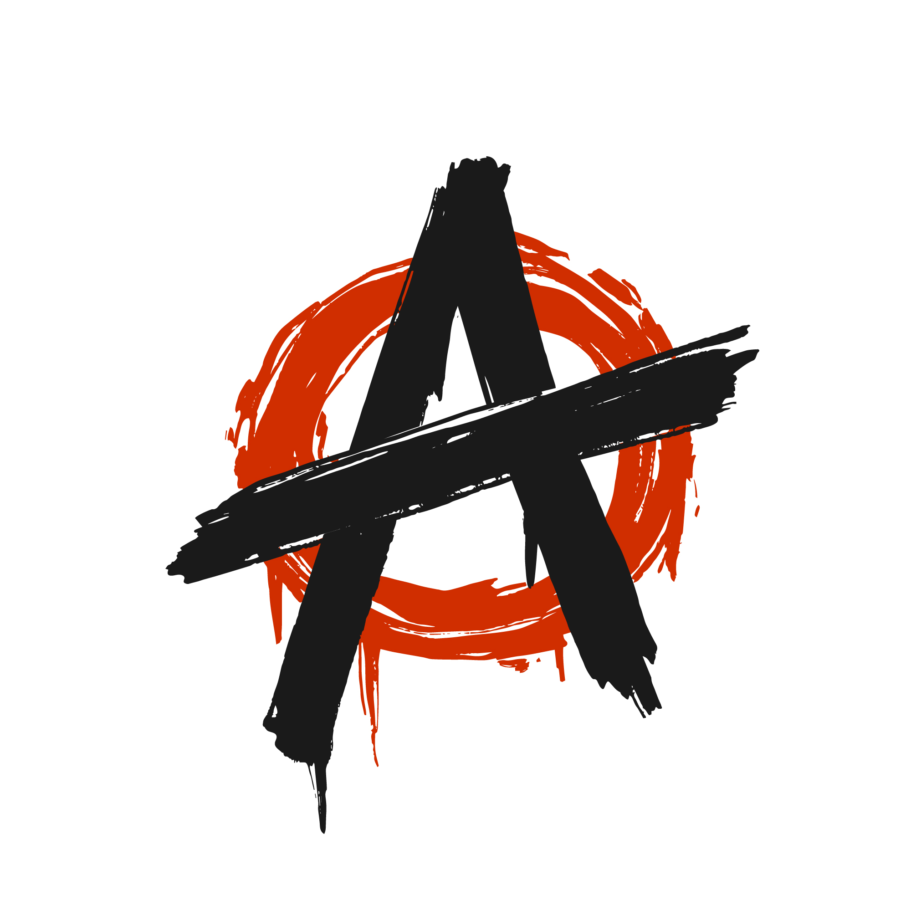

<a id="readme-top"></a>

<!-- PROJECT SHIELDS -->
<!--
*** I'm using markdown "reference style" links for readability.
*** Reference links are enclosed in brackets [ ] instead of parentheses ( ).
*** See the bottom of this document for the declaration of the reference variables
*** for contributors-url, forks-url, etc. This is an optional, concise syntax you may use.
*** https://www.markdownguide.org/basic-syntax/#reference-style-links
-->
[![Forks][forks-shield]][forks-url]
[![Stargazers][stars-shield]][stars-url]
[![Issues][issues-shield]][issues-url]
[![MIT License][license-shield]][license-url]
[![LinkedIn][linkedin-shield]][linkedin-url]


<!-- PROJECT LOGO -->
<br />
<div align="center">
  <a href="https://github.com/aayushmishramechatronics/cp-mit-manipal">
    
  </a>

<h3 align="center">cp-mit-manipal</h3>

  <p align="center">
    Official Competitive Programming Community Website for MIT Manipal Students, designed and developed by Aayush Mishra.
    <br />
    <a href="https://github.com/aayushmishramechatronics/cp-mit-manipal"><strong>Explore the Repository »</strong></a>
    <br />
    <br />
    <a href="https://cp-mit-manipal.vercel.app/">View Demo</a>
    &middot;
    <a href="https://github.com/aayushmishramechatronics/cp-mit-manipal/issues/new?labels=bug&template=bug-report---.md">Report Bug</a>
    &middot;
    <a href="https://github.com/aayushmishramechatronics/cp-mit-manipal/issues/new?labels=enhancement&template=feature-request---.md">Request Feature</a>
  </p>
</div>


<!-- TABLE OF CONTENTS -->
<details>
  <summary>Table of Contents</summary>
  <ol>
    <li>
      <a href="#about-the-project">About The Project</a>
      <ul>
        <li><a href="#built-with">Built With</a></li>
      </ul>
    </li>
    <li>
      <a href="#getting-started">Getting Started</a>
      <ul>
        <li><a href="#prerequisites">Prerequisites</a></li>
        <li><a href="#installation">Installation</a></li>
      </ul>
    </li>
    <li><a href="#usage">Usage</a></li>
    <li><a href="#roadmap">Roadmap</a></li>
    <li><a href="#contributing">Contributing</a></li>
    <li><a href="#license">License</a></li>
    <li><a href="#contact">Contact</a></li>
    <li><a href="#acknowledgments">Acknowledgments</a></li>
  </ol>
</details>


<!-- ABOUT THE PROJECT -->
## About The Project

[![Product Name Screen Shot][product-screenshot]](https://example.com)

CodeCraft is the official Competitive Programming (CP) community of MIT Manipal, designed to foster a collaborative environment for students passionate about coding. The platform offers curated learning resources, insightful blog posts, and regular contests to help members enhance their problem-solving skills and prepare for technical interviews.


<p align="right">(<a href="#readme-top">back to top</a>)</p>


### Built With

* [![Next.js][Next.js]][Next-url]
* [![TypeScript][TypeScript]][TypeScript-url]
* [![JavaScript][JavaScript]][JavaScript-url]
* [![Tailwind CSS][Tailwind]][Tailwind-url]

<p align="right">(<a href="#readme-top">back to top</a>)</p>


<!-- GETTING STARTED -->
## Getting Started

Follow these steps to set up and run the project locally on your machine.

### Prerequisites

Ensure you have **Node.js** and **npm** installed on your system.

* npm
  ```sh
  npm install npm@latest -g
  ```

### Installation

1. Clone the repo
   ```sh
   git clone https://github.com/aayushmishramechatronics/cp-mit-manipal.git
   ```
2. Install NPM packages
   ```sh
   npm install
   ```
3. Change git remote url to avoid accidental pushes to base project
   ```sh
   git remote set-url origin aayushmishramechatronics/cp-mit-manipal
   git remote -v # confirm the changes
   ```
4. Open your browser and go to http://localhost:3000
   
<p align="right">(<a href="#readme-top">back to top</a>)</p>


<!-- USAGE EXAMPLES -->
## Usage

This website can be used for:

1. Learning Resources: Access a collection of tutorials and courses ranging from beginner to advanced levels, including topics like Dynamic Programming, Graph Algorithms, and more.

2. Blogs & Articles: Read articles from renowned programmers covering strategies, algorithmic techniques, and personal experiences in competitive programming.

4. Community Engagement: Join the WhatsApp group to connect with peers, participate in discussions, and stay updated on upcoming contests and events.

<p align="right">(<a href="#readme-top">back to top</a>)</p>


<!-- ROADMAP -->
## Roadmap

- [ ] User Authentication: Implement login functionality to personalize user experience and track progress.
- [ ] Contest Platform: Integrate a feature for hosting and participating in live coding contests directly on the platform.
- [ ] Progress Tracking: Allow users to monitor their learning journey and achievements over time.
- [ ] Resource Expansion: Continuously update the repository with new tutorials, problem sets, and articles.
    - [ ] Community Forums: Create a space for users to ask questions, share solutions, and collaborate on problems.

see the [open issues](https://github.com/aayushmishramechatronics/cp-mit-manipal/issues) for a full list of proposed features (and known issues).

<p align="right">(<a href="#readme-top">back to top</a>)</p>


<!-- CONTRIBUTING -->
## Contributing

Contributions are what make the open source community such an amazing place to learn, inspire, and create. Any contributions you make are **greatly appreciated**.

If you have a suggestion that would make this better, please fork the repo and create a pull request. You can also simply open an issue with the tag "enhancement".
Don't forget to give the project a star! Thanks again!

1. Fork the Project
2. Create your Feature Branch (`git checkout -b feature/FeatureBranch`)
3. Commit your Changes (`git commit -m 'Add Changes'`)
4. Push to the Branch (`git push origin feature/PushtoBranch`)
5. Open a Pull Request

<p align="right">(<a href="#readme-top">back to top</a>)</p>


<!-- LICENSE -->
## License

Distributed under the MIT License. See `LICENSE.txt` for more information.

<p align="right">(<a href="#readme-top">back to top</a>)</p>


<!-- CONTACT -->
## Contact

Aayush Mishra - [X](https://x.com/AayushMish33852) - aayushmishra1105@gmail.com

Project Link: [https://github.com/github_username/repo_name](https://github.com/aayushmishramechatronics/cp-mit-manipal)

<p align="right">(<a href="#readme-top">back to top</a>)</p>


<!-- ACKNOWLEDGMENTS -->
## Acknowledgments

* [Image Shields](https://shields.io/)
* [GitHub Pages](https://pages.github.com)
* [Font Awesome](https://fontawesome.com)
* [React Icons](https://react-icons.github.io/react-icons/search)

<p align="right">(<a href="#readme-top">back to top</a>)</p>


<!-- MARKDOWN LINKS & IMAGES -->
<!-- https://www.markdownguide.org/basic-syntax/#reference-style-links -->
[forks-shield]: https://img.shields.io/github/forks/aayushmishramechatronics/cp-mit-manipal.svg?style=for-the-badge
[forks-url]: https://github.com/aayushmishramechatronics/cp-mit-manipal/network/members
[stars-shield]: https://img.shields.io/github/stars/aayushmishramechatronics/cp-mit-manipal.svg?style=for-the-badge
[stars-url]: https://github.com/aayushmishramechatronics/cp-mit-manipal/stargazers
[issues-shield]: https://img.shields.io/github/issues/aayushmishramechatronics/cp-mit-manipal.svg?style=for-the-badge
[issues-url]: https://github.com/aayushmishramechatronics/cp-mit-manipal/issues
[license-shield]: https://img.shields.io/github/license/aayushmishramechatronics/cp-mit-manipal.svg?style=for-the-badge
[license-url]: https://github.com/aayushmishramechatronics/cp-mit-manipal/blob/master/LICENSE.txt
[linkedin-shield]: https://img.shields.io/badge/-LinkedIn-black.svg?style=for-the-badge&logo=linkedin&colorB=555
[linkedin-url]: https://www.linkedin.com/in/aayush-anil-mishra/
[product-screenshot]: images/screenshot.png
[Next.js]: https://img.shields.io/badge/Next.js-000000?style=for-the-badge&logo=next.js&logoColor=white
[Next-url]: https://nextjs.org/
[TypeScript]: https://img.shields.io/badge/TypeScript-3178C6?style=for-the-badge&logo=typescript&logoColor=white
[TypeScript-url]: https://www.typescriptlang.org/
[JavaScript]: https://img.shields.io/badge/JavaScript-F7DF1E?style=for-the-badge&logo=javascript&logoColor=black
[JavaScript-url]: https://developer.mozilla.org/en-US/docs/Web/JavaScript
[Tailwind]: https://img.shields.io/badge/Tailwind_CSS-38B2AC?style=for-the-badge&logo=tailwind-css&logoColor=white
[Tailwind-url]: https://tailwindcss.com/
